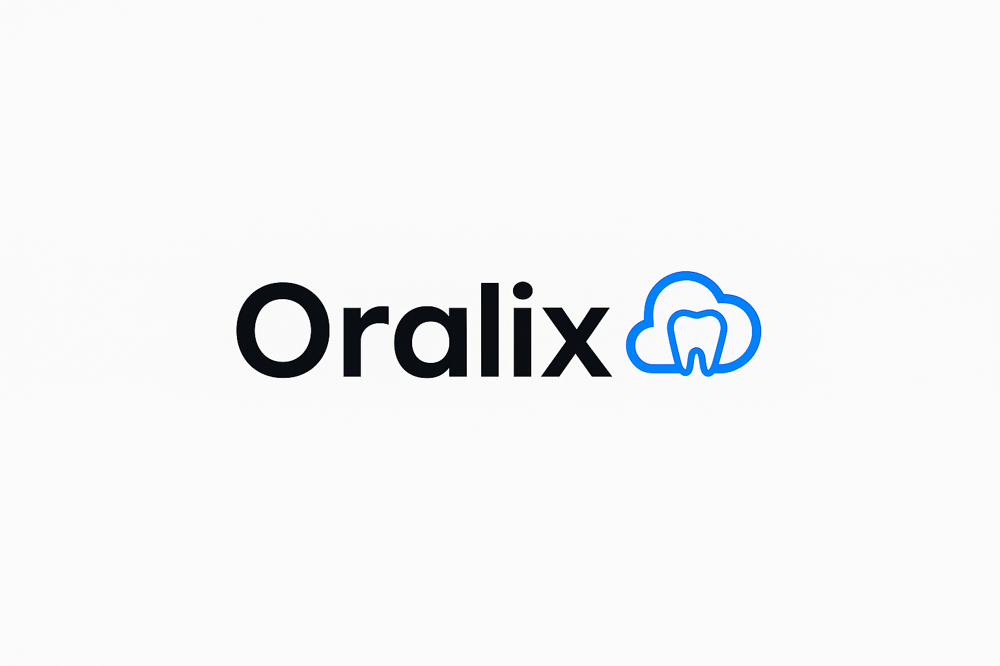

# 🦷 Oralix - Sistema de Gestão Odontológica Inteligente



**Digitalize sua clínica. Encante seus pacientes.**

---

## 🌟 Visão Geral
O **Oralix** é uma plataforma **all-in-one** que transforma a gestão de clínicas odontológicas, substituindo processos manuais por fluxos digitais intuitivos. Com **Web App para profissionais** e **Mobile App para pacientes**, oferecemos:

- 📅 **Agendamento inteligente**
- 🦷 **Prontuário eletrônico com odontograma digital**
- 💰 **Controle financeiro integrado**
- 📱 **Acesso remoto a exames e receitas**

**Stack Moderna:** NestJS (Backend), React/React Native (Frontend), PostgreSQL + Prisma ORM.

---

## 🚀 Funcionalidades

### Para Clínicas (Web App)
| Ícone | Funcionalidade           | Descrição                                  |
|-------|--------------------------|--------------------------------------------|
| 📅    | Agenda Inteligente       | Visualização por profissional/dia/semana.  |
| 🖥️    | Prontuário Eletrônico    | Histórico completo + odontograma digital.  |
| 💸    | Gestão Financeira        | Faturamento, recebimentos e relatórios.    |

### Para Pacientes (Mobile App)
| Ícone | Funcionalidade           | Descrição                                  |
|-------|--------------------------|--------------------------------------------|
| 📱    | Agendamento Online       | Escolha de horários em tempo real.         |
| 🏥    | Acesso a Documentos      | Exames, receitas e planos de tratamento.   |
| 🔔    | Lembretes Automáticos    | Notificações para consultas e pagamentos.  |

---

## 🛠 Tecnologias

<div align="center">

| **Backend**       | **Frontend Web**   | **Mobile**         | **Banco de Dados** |
|-------------------|--------------------|--------------------|--------------------|
|  |  |  |  |
|  |  |  |  |

</div>

---

## 📂 Estrutura do Projeto
```bash
oralix/
├── apps/
│   ├── api/          # Backend (NestJS)
│   ├── web/          # Frontend Web (React)
│   └── mobile/       # App Mobile (React Native)
├── packages/
│   ├── ui/           # Componentes compartilhados
│   └── config/       # Configurações globais
└── README.md         # Este arquivo
