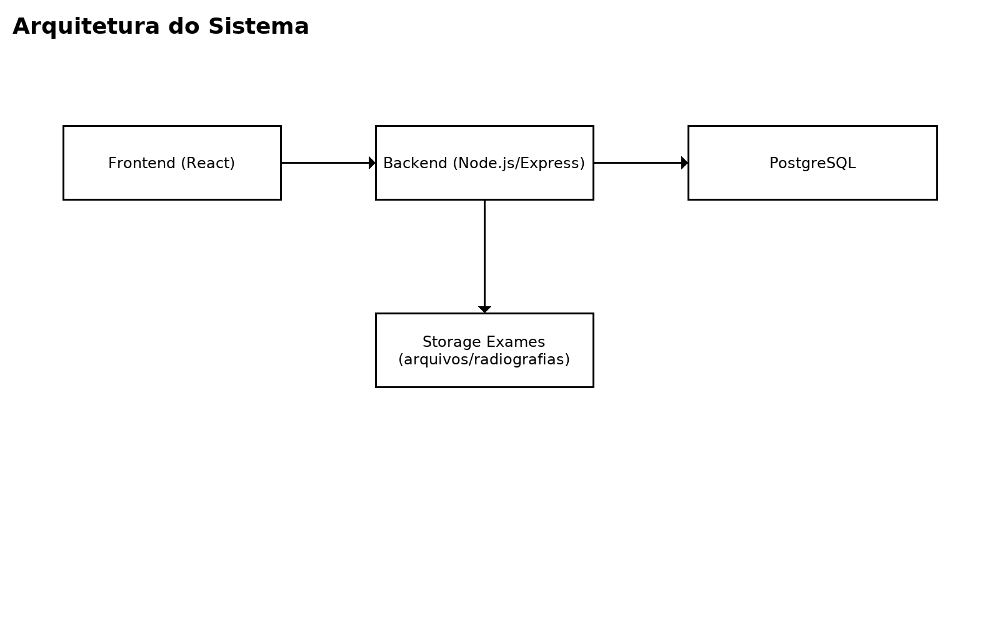
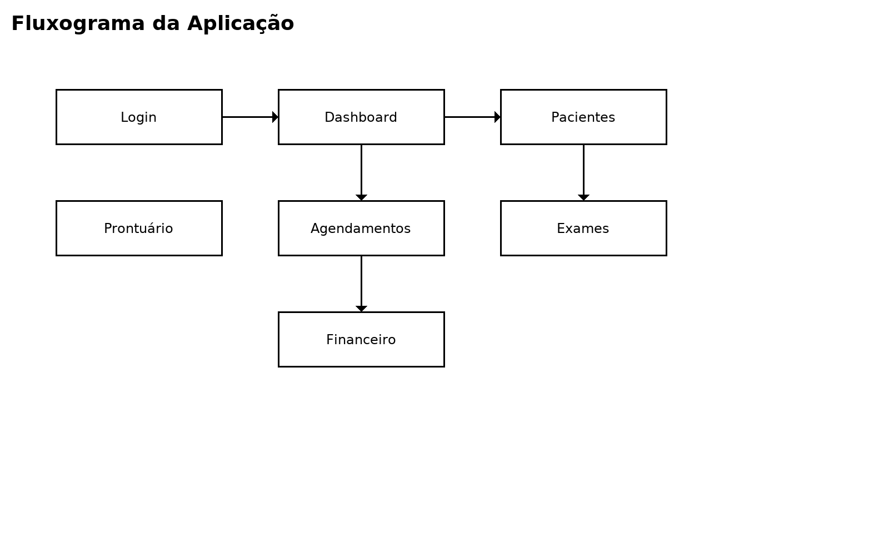

# 🦷 Oralix – Prontuário Odontológico Digital



## 📌 Visão Geral
O **Oralix** é um sistema de prontuário odontológico digital que centraliza pacientes, tratamentos, exames e agendamentos, pensado para clínicas e apoio ao ensino.

## 🏗 Arquitetura
- **Frontend (React)** – UI responsiva.
- **Backend (Node.js/Express)** – API REST.
- **PostgreSQL** – Banco de dados relacional.



## 📂 Estrutura
```
oralix/
├── oralix-frontend/
├── oralix-backend/
├── docs/
│   ├── fluxograma-aplicacao.png
│   ├── fluxograma-banco.png
│   ├── fluxograma-frontend.png
│   ├── fluxograma-backend.png
│   └── arquitetura-sistema.png
├── LICENSE
├── SECURITY.md
├── CONTRIBUTING.md
├── CODE_OF_CONDUCT.md
├── .editorconfig
├── .gitignore
└── README.md
```

## 🗄 Modelo de Dados (SQL)
Esquema inicial em `docs/schema.sql`.

## 🚀 Como rodar (dev)
- **Backend**: `cd oralix-backend && npm install && npm run dev`
- **Frontend**: `cd oralix-frontend && npm install && npm run dev`

## 🤝 Contribuindo
Leia `CONTRIBUTING.md` e abra um Pull Request.

## 📜 Licença
MIT – veja `LICENSE`.
